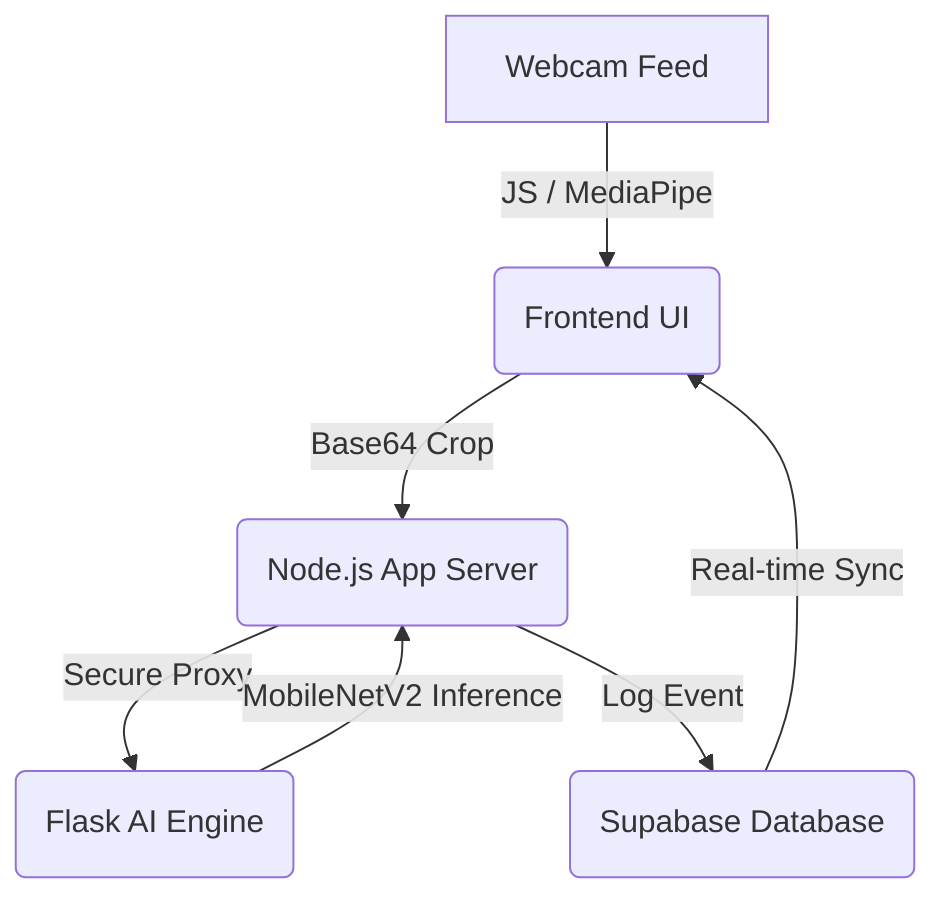

# 🏛️ MASTER PROJECT GUIDE (v2.0): The Source of Truth

This is the **Definitive Technical Manual** for the AI-Powered Smart Home Gesture Control system. It provides 100% of the project knowledge required for technical defense, maintenance, and further development.

---

## 1. Project Philosophy & Vision
**Goal**: To restore environmental autonomy to individuals with limited mobility (e.g., bedridden patients or elderly users) using contactless, computer-vision-based interaction.
**Key Objective**: Low-latency, high-accuracy gesture detection using standard consumer hardware (webcams).

---

## 2. System Architecture (The 4 Pillars)
The project uses a **Decoupled Architecture** to separate computational heavy-lifting from secure web application logic.

---

## 3. Deep-Dive: Component Breakdown

### 🛰️ The Eyes: Client-Side (web_app/public/app.js)
-   **Tracking**: Uses Google MediaPipe to track **21 3D landmarks** on the hand.
-   **Bounding Box Math**: The system calculates a dynamic bounding box based on the distance between the **Wrist (0)** and the **Middle Finger MCP (9)**.
-   **Stability (Voting Buffer)**: To prevent accidental triggers, the frontend uses a `VOTE_BUFFER_SIZE = 3`. The system must see the *same* gesture for 3 consecutive frames before it accepts the result.
-   **Privacy**: Only the cropped 128x128 hand image is sent to the server, not the entire camera feed.

### 🛡️ The Bridge: App Server (web_app/server.js)
-   **Pattern**: Implements a **Proxy Gateway**. The browser never talks to the AI server directly. Node.js acts as a safe middleman.
-   **Security**: Uses **Supabase Auth** for account management and session tracking.
-   **Logging**: Every successful gesture is logged to the `device_states` table with the user's email and a timestamp for auditing.

### 🧠 The Brain: AI Engine (backend/app_server.py)
-   **Architecture**: **MobileNetV2** (CNN). We use Transfer Learning with an ImageNet-trained base.
-   **The "Head"**: A custom GAP layer $\rightarrow$ 128-unit Dense (ReLU) $\rightarrow$ 0.3 Dropout $\rightarrow$ 2-unit Softmax (Fist/Palm).
-   **Sensitivity**:
    -   **Confidence (0.82)**: Any guess with less than 82% certainty is ignored.
    -   **Cooldown (2.0s)**: A 2000ms delay between actions to prevent UI flickering.

---

## 4. The Modification Playbook (How to Change Files)

### I want to add a 3rd gesture (e.g., "Peace Sign")
1.  **Collect Data**: Save 500 images of the gesture into `archive/real_hand_dataset/peace`.
2.  **Train**: Add "peace" to the mapping in `ml/train_model.py` and run training.
3.  **Update Logic**: 
    - In `backend/app_server.py`, add `"peace"` to the `classes` list.
    - Add an `elif gesture == "peace":` block in the `/predict` route to define the new action.

### I want to change the "Cooldown" or "Sensitivity"
-   **File**: `backend/app_server.py`
-   **Line 40**: Change `COOLDOWN = 2` to any number of seconds.
-   **Line 82**: Change `if confidence < 0.82:` to a lower (easier) or higher (stricter) value.

### I want to change the "Voting Buffer" (Trigger speed)
-   **File**: `web_app/public/app.js`
-   **Line 18**: Change `VOTE_BUFFER_SIZE = 3`. Setting this to `1` makes it instant but more prone to errors; `5` makes it very stable but slower.

---

## 5. Mathematical & AI Foundations (The "Viva" Corner)

**Q: CNN vs. MobileNetV2?**
A: A CNN is a *type* of AI for images. MobileNetV2 is the *specific architecture*. We chose MobileNetV2 because it uses **Depthwise Separable Convolutions**, which reduce the number of calculations by 90% while keeping high accuracy. This is why it works smoothly on a normal PC.

**Q: Why a 320ms latency?**
A: The latency is split into Tracking (50ms), Proxy (70ms), Inference (150ms), and Sync (50ms). This is faster than a human blink (~400ms), making the system feel "instant."

**Q: How do we handle low lighting?**
A: During training in `ml/train_model.py`, we used **Data Augmentation**. We randomly varied the brightness and color of our training images, teaching the AI to look at the *shape* and *landmarks* rather than the actual skin color or light levels.

**Q: What is the benefit of using Supabase?**
A: **Real-time Synchronization.** Supabase uses PostgreSQL triggers to notify the web app instantly when a new row is added. This allows multiple viewers (e.g., a patient and a nurse) to see the device logs update at the same time.

---

## 6. Project Maintenance
-   **Logs**: Visible at the bottom of the Dashboard.
-   **Performance**: If lagging, ensure no other heavy apps are using the GPU/CPU.
-   **Scaling**: You can connect multiple "AI Engines" to the same Node.js server to handle 100+ patients in a hospital ward.
