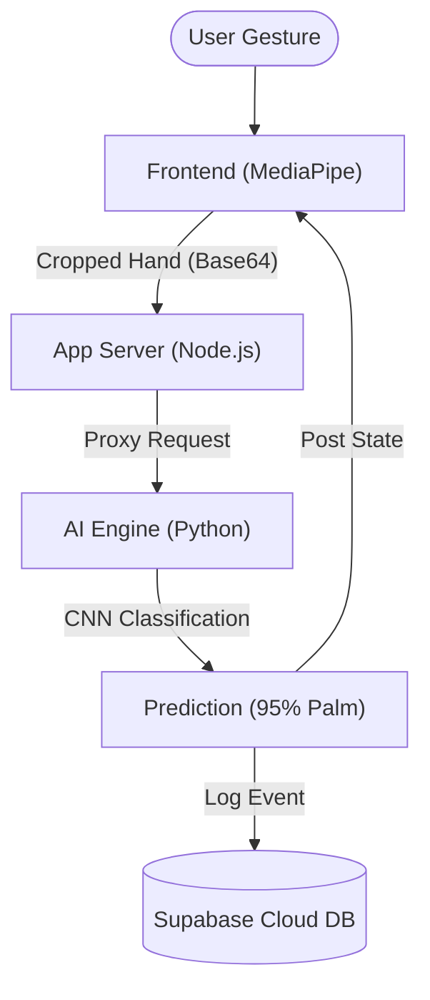

# 🖐️ AI Smart Home Gesture Controller: Project Blueprint

> **Objective:** A high-impact, professional explanation of the project for academic or professional evaluation.

---

## 🏗️ The High-Level Architecture

### 🧱 The 4-Layer "Full-Stack" Stack
| Layer | Responsibility | Technology |
| :--- | :--- | :--- |
| **I. Vision** | Real-time hand tracking and 21 landmark detection. | **MediaPipe Hands** |
| **II. Security** | User Auth and secure proxy gateway to AI resources. | **Node.js + Supabase** |
| **III. Intelligence** | High-performance CNN inference for gesture mapping. | **Python (TensorFlow)** |
| **IV. Memory** | Persistent cloud logging and session management. | **Supabase Postgres** |

---

## 📂 Repository Structure (Simplified)
*   `web_app/`: The primary control center (Node.js API & Glassmorphism Dashboard).
*   `backend/`: The dedicated AI microservice (Python/Flask).
*   `ml/`: The "Brain" containing the `.h5` model and training scripts.

---

## ⚙️ The 5-Step Execution Cycle
1.  **Detection**: MediaPipe identifices hand bones in the browser at **30+ FPS**.
2.  **Smart Crop**: We extract a scale-preserved square of the hand to maintain CNN accuracy.
3.  **Proxy Bridge**: Node.js receives the image, validates the user, and forwards it to Python.
4.  **Classification**: The **MobileNetV2 CNN** classifies the gesture (e.g., Palm = Light Toggle).
5.  **Audit Trail**: Every action is stamped with a timestamp and user ID in the **Cloud Database**.

---

## 💡 Why This Architecture?
-   **Client-Side Detection**: Detection runs in the browser, saving ~90% bandwidth.
-   **Polyglot Backend**: Node.js for scalable I/O and Python for heavy ML lifting.
-   **Cloud-First**: Using Supabase ensures data is secure and accessible globally.

---

### 🚀 Launch Sequence
1.  `cd backend && python app_server.py` (AI Engine)
2.  `cd web_app && node server.js` (App Server)
3.  Visit `http://localhost:3000` to begin.
